## 等待被翻译

非常抱歉，看起来这篇博文还没有被翻译成中文，请等待一段时间

## Summary

My note while learning through CSAPP-15213 videos. Including Overview, Bits,Bytes, and Integers, Floating Point, Machine Level Programing, Program Optimization and Memory. Source code: [https://github.com/yewentao256/CSAPP_15213]

## 1. Overview

### Course theme

- theme：Abstraction is good but don't forget reality

### Five realities

- **ints are not integers；floats are not real**
  - To understand numbers in computer
  - eg：`x^2 >= 0`?
    - for float：yes！
    - for int： `40000*40000=1600000000` yes! `50000*50000=??` not!
  - eg：`(x+y) + z = x+(y+z)`?
    - for int: yes!
  - for于 float: `(1e20+-1e20)+3.14 = 3.14`； `(1e20+(-1e20+3.14) = ??`
- **you've got to know assembly**
  - learning about assembly
- **memory matters**
  - memory management
  - eg：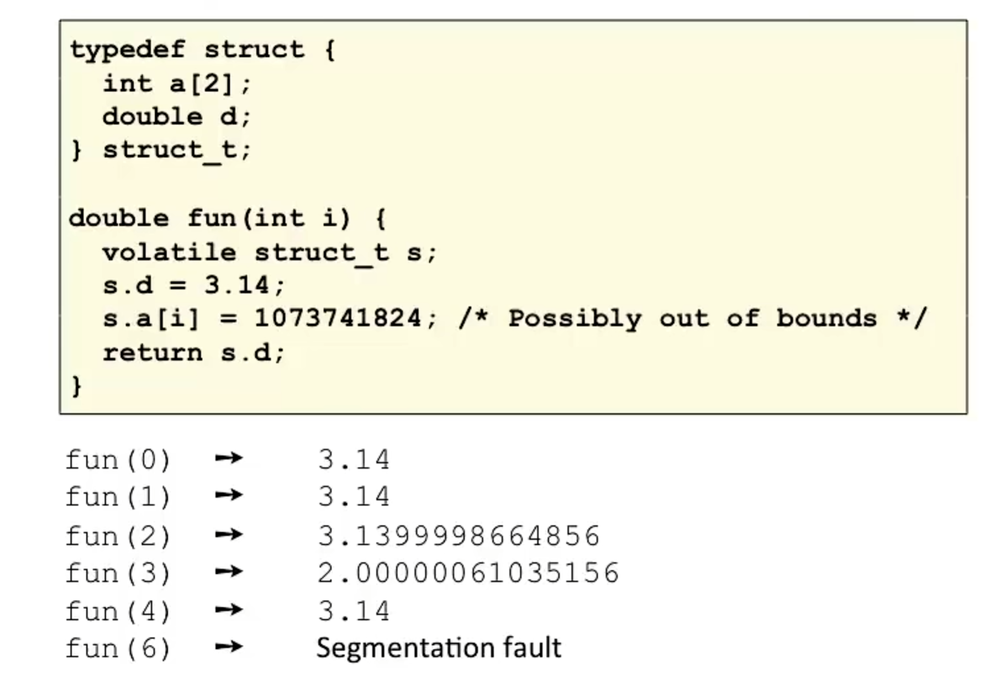
- **there's more to performance than asymptotic complexity**
  - eg：
- **computers do more than execute programs**
  - IO/network

### How the course fits into the CS/ECE curriculum

build up the base for another courses.

### Course architecture

- programs and data
  - L1(datalab): manipulating bits
  - L2(bomblab): defuse a binary bomb
  - L3(attacklab): injection attacks

- memory hierarchy
  - L4(cachlab): build a cache simulator

- Exceptional control flow
  - L5(tshlab): write a shell

- Virtual memory
  - L6(malloclab): write a malloc package

- networking and concurrency
  - L7(proxylab): write a web proxy

## 2. Bits,Bytes, and Integers

### Representing information as bits

- Everything is bits.
- Encoding Byte values.

### Bit-level manipulations

- Boolean Algebra
- Bit-level options in C: & | ~ ^
- Logic Operations in C: && || !
- Shift operations
  - eg: 

### Integers

#### Unsigned and signed

- Numeric ranges
  - signed: Tmax, Tmin
  - unsigned: Umax, Umin

#### Conversion, casting

- B2T, T2B
- B2U, U2B
- U2T, T2U
- Note: if both signed and unsigned in one expression, **signed value implicitly cast to unsigned**.
  - eg: `for(int i = n; i-sizeof(char); i--) {}  // run forever!`
- Corner case: normally -(-x) = x, but **-Tmin(-32) != Tmax(31)** (number is in 5 bits)

#### Expanding, truncating

- expanding
  - eg: 1010(-6) -> 111010(-6)
- truncating
  - eg: unsigned: `11011(27) -> 1011(9)  // mod 16`
  - just remember: directly get the bytes then calculate it.

#### Addition, negation, multiplication, shifting

- addition(negation)
  - unsigned addition
  - complement addition
  - overflow
- multiplication
  - unsigned multiplication
  - signed multiplication
    - eg: 5 * 5 = 25:0001-1001(-7). the result is -7
- shift
  - power-of-2 multiply with shift
  - unsigned power-of-2 division with shift
    - eg: 0011(3) /2 (>>1) = 0001(1)--logical shift
  - signed power-of-2 division:
    - eg: 1101(-3) /2 (>>1) = 1110(-2)--arithmetic shift

- extra:
  - x -> -x, just do !x+1
    - eg: -(1010) (-6) = 0101+0001 = 0110(6)

### Representations in memory, pointers and strings

- Byte-Oriented Memory Organization
- Machine words: 32bits, 64bits
- Word-Oriented Memory Organization
- Byte Ordering
  

## 3. Floating Point

### Fractional binary number

eg:

- 5 + 3/4 = 101.11~2~
- 2 + 7/8 = 10.111~2~
- 1/3 = 0.0101[01]...~2~

### IEEE Floating Point

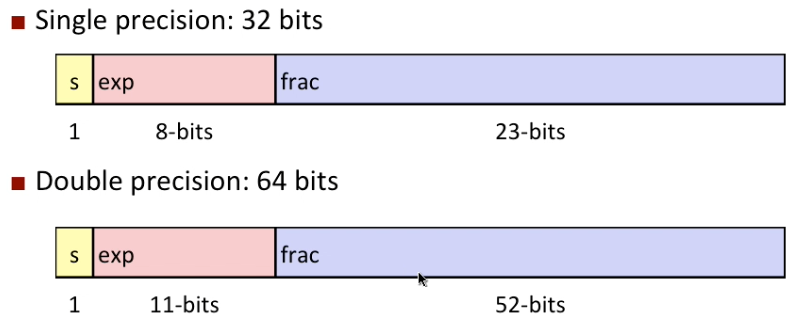

- **f = (-1)^s^  M  2^E^**
  - `E = exp - Bias`
    - eg. exp has 8 bits, **Normally** 1<=exp<=254, bias = 127, so `-126<=E<=127`
    - why introducing the `bias`? for better comparison
  - M = 1.0 + frac = 1.xxxx..x~2~
    - eg. minimum: xxxx..x = 0000..0, M = 1.0
    - eh. maximum: xxxx..x = 1111..1, M -> 2.0
  - Take 15123 as an example:
    - 15213 = 11101101101101~2~ = 1.1101101101101~2~ * 2^13^
    - M = 1.1101101101101~2~, frac = `1101101101101` + `0000000000`
    - E = 13, bias = 127 -> exp = 140 = 10001100~2~
    - so result:
      - 0
      - 10001100
      - 1101101101101 0000000000
      - totally 32 bits

- For **Denormalized Number**: when exp = 00000..0
  - **E = 1 - bias**,
  - **M = frac** (no leading 1)
  - cases:
    - frac = 0000.0: representing `0` (including `-0` and `+0`)
    - frac != 0000.0: closest to `0`

- For **Denormalized Number**: when exp = 1111..1
  - **E = 1 - bias**,
  - **M = frac** (no leading 1)
    - why for this? to represent more numbers, see the figure below
  - cases:
    - frac = 0000.0: representing `inf`
    - frac != 0000.0: representing `nan`

- Examples together


- Note: when closing to 0, the numbers get denser

### Rounding, addition and multiplication

#### Round

- strategy
  - Towards 0
  - Round down(-inf)
  - Round up(+inf)
  - Nearest Even(**default**)

- eg: round to nearest 1/4
  - 2 + 3/16 = 10.00`110`~2~ = 10.01~2~ (>1/2 - UP)
  - 2 + 7/8 = 10.11`100`~2~ = 11.00~2~ (exactly half)
  - 2 + 5/8 = 10.10`100`~2~ = 10.10~2~ (exactly half)

#### multiplication

- (-1)^s1^  M1  2^E1^ * (-1)^s2^  M2  2^E2^
  - s = s1 ^ s2
  - M = M1 * M2
  - E = E1 + E2

- if after calculation,
  - M > 2 -> shift M right, **increment E**
  - If E out of range, **overflow**
  - Round M to fit **frac**

So now you understand why `(1e20*1e20)*1e-20 = inf`； `(1e20*(1e-20*1e20) = 1e20`

`a>=b & c>=0 so a*c >= b*c`? Almost, Always consider **inf** and **nan**

#### addition

core: **get binary points lined up**

- (-1)^s1^  M1  2^E1^ + (-1)^s2^  M2  2^E2^

- if after calculation,
  - M > 2 -> shift M right, **increment E**
  - M < 1 -> shift M left, **decrement E**
  - If E out of range, **overflow**
  - Round M to fit **frac**

So now you understand why `(1e20+-1e20)+3.14 = 3.14`； `(1e20+(-1e20+3.14) = ??`

### Floating point to C

int -> float: round 32 bits value to 23 bits frac

double -> int: round 52 bits frac to 32 bits

2/3 != 2/3.0 (floating point)

double d < 0 -> d*2 <0 (YES! even if overflow, it's `negative inf`)

## 4. Machine Level Programing

### C, assembly, machine code

The process of compiling C:

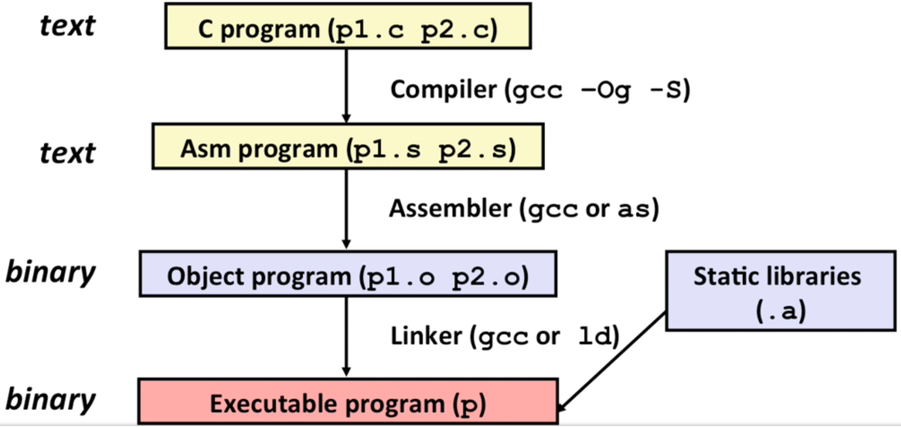

Compiler: GCC, to make assembly code: `gcc -Og -S ...`

to make exec file(actually bytes of instructions) into assembly code: `objdump -d ...`

### Assembly Basics: Registers, operands, move

Some specific registers:

- `%rsp`: stack pointer
- `%rdi`: first argument of function
- `%rsi`: second argument of function
- `%rdx`: third argument of function

the relationships between different names of a register:

```bash
|63..32|31..16|15-8|7-0|
              | AH |AL |
              | AX.....|
       |EAX............|
|RAX...................|
```

Memory access of **moveq**:

- Normally: `(%rax)` = `Mem[rax]`
- With offset: `8(%rax)` = `Mem[rax + 8]`
- Generally: `D(Rb, Ri, S)` = `Mem[Rb + S * Ri + D]`

### Arithmetic & logical operations

For example: **leaq**

- `leaq 4(%rsi, %rsi, 2), %rdx`: `rdx = rsi + 2 * rsi + 4`

### Control: Condition codes

- `%rip`: instruction pointer
- **Condition Codes**
  - `CF`(carry flag)--for `unsigned` overflow
  - `ZF`(zero flag)
  - `SF`(sign flag)--for `signed`
  - `OF`(overflow flag)-- for `signed` overflow

- `cmpq`: compare number (`b-a`) and set condition codes above
- `testq`: compare number (`a&b`) but only set `ZF` and `SF`
- `setX`: set the low-order byte of destination to `0` or `1` based on the condition codes above


- example

```c
int gt (long x, long y) {return x>y;}
```

```assembly
# compare x, y  (%rsi is y, %rdi is x)
cmpq    %rsi, %rdi

# Set when > (if x-y > 0, SF=1 and OF=1 or SF=0, OF=0)
setg    %al

# move bytes to long, zero padding
# Note this is %eax rather than %rax
# this is because 32-bit instructions also set upper 32 bits to 0.
movzbl  %al,  %eax
ret
```

### Conditional branches

- `jX`: jump to different part of code depending on condition codes

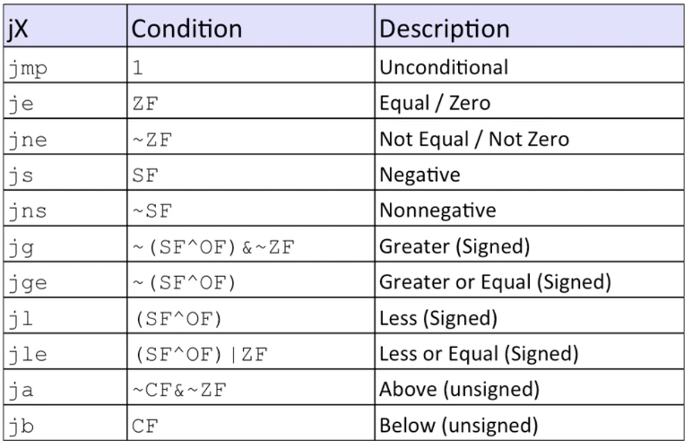

- Note: Sometimes like `Test? x+y:x-y` in C, it's efficient to calculate `x+y` and `x-y` both, then choose one using `conditional move` rather than using branches. Since **branches are very disruptive to instruction flow through pipelines**

- `conditional move`
  - eg: `cmovle %rdx %rax`: if <=, result = %rdx
  - only use this when calculation is simple and is safe!

### Loops

Using branches and control introduced above to realize `do-while`, `while` and `for`.

### Switch Statements

- Structure:


- How to form a jump table?

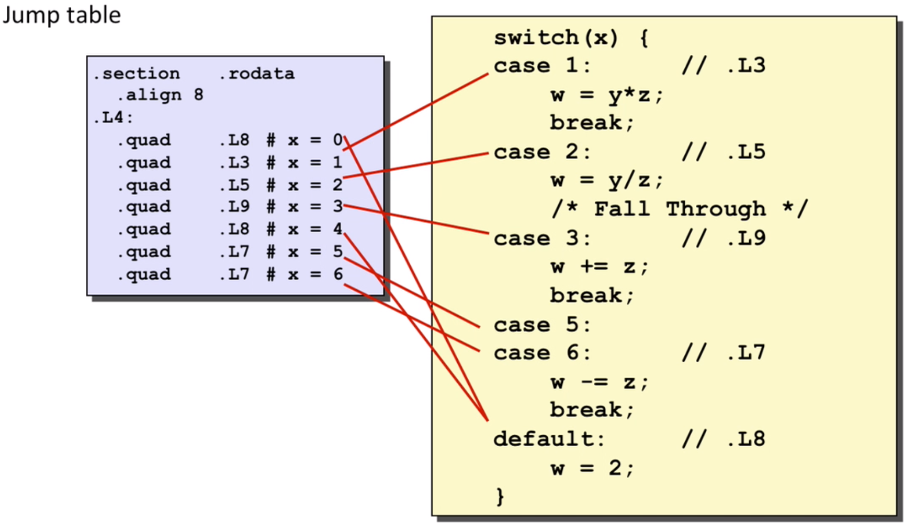

Normally to make an array, and for some holes like `x=0`, `x=4`, let it go to the default part.

Note: if x has a extremely large case like 10086, it can add a **bias** then make an array flow(like mapping to 7), too. Or sometimes it can be optimized to a decision tree--simple **if else** structure(in cases it's hard to make an array flow)

- How to jump through table?

```assembly
# x compare 6
cmpq $6, %rdi

# Use default: since we use **ja**(unsigned) here
# jump if x > 6 or x < 0(unsigned negative is a large positive)
ja   .L8

# refer to (L4 + 8 * %rdi) address, get the value of it and then jump
jmp *.L4(, %rdi, 8)
```

### Stack Structure


### Calling Conventions

- passing control: when calling a function, push the next instruction address to the stack, when ret, get the address back then jump to the address.


- passing data:

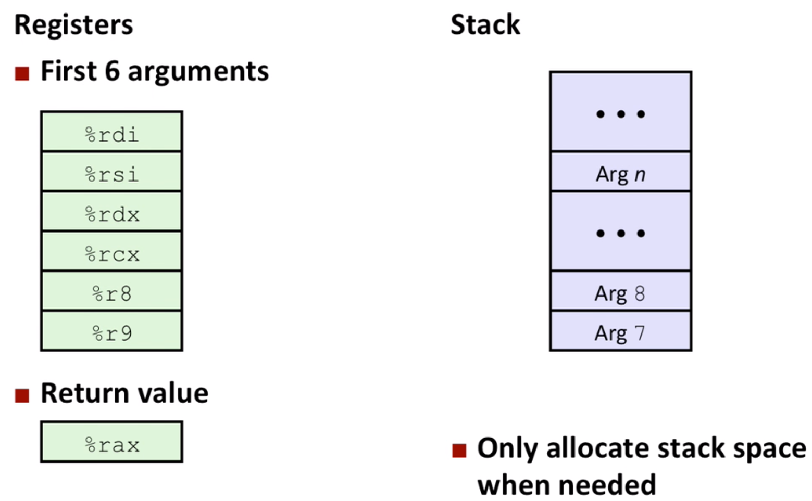

- save local data:


Normally, use `%rsp` directly, sub some value at the beginning, then add it back before `return`.


It's OK to use `movl` to `%esi`, since the rest of 32 bits would be set to zero. This depends on the compiler

Sometimes use `%rbp`, like allocating an array or memory buffer

- **Caller Saved** and **Callee Saved**

Rules we need to obey, set in ABI(application binary interface)

caller saved: the register can be overwritten--`%rax`, all of the arguments from `%rdi` to `%r9`, tmp `%r10` and `%r11`

callee saved: the callee make sure not to affect any data used in the caller--`%rbx`, from `%r12` to `%r14`, `%rbp` and `%rsp`

- recursive function example:


### Arrays


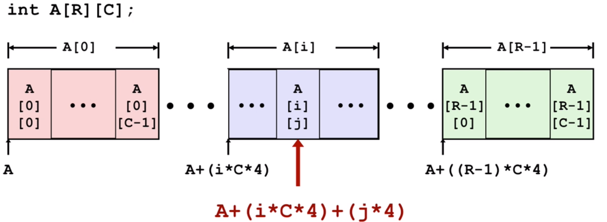

### Structures


### Floating Point

float add(param passed in `%xmm0`, `%xmm1`):


double add:


### Memory Layout


- **stack** for local variable (if more than 8MB, segmentation fault)
- **heap** memory is dynamically allocated for `malloc`、`new` ...
- **data** is for `static` data
- **Text/Shared** Libraries for executable instructions(read only)

### Buffer Overflow

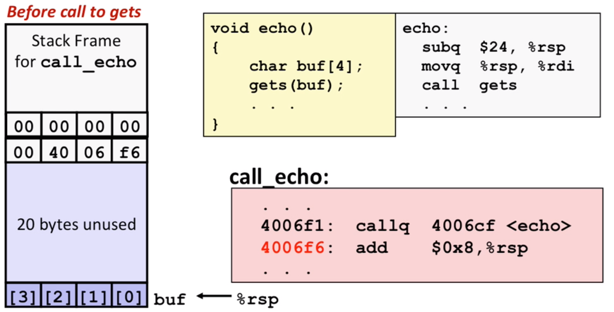

If you input 23 characters in `gets()`, it's ok (a default `\0` at the end of line)

If you put 24 characters or more, it will gets to the `return address` and may cause a `segmentation fault`(depends on the address you jump to)

#### code injection attacks

Covering the return address, and use the instruction we input (see `attacklab` for more details)

Ways to avoid:

- avoid overflow Vulnerabilities in Code:
  - `fgets` instead of `gets`
  - `strncpy` instead of `strcpy`
  - don't use `scanf` with `%s`
- system-level protections
  - random stack offset: hard to predict the beginning of code
  - non-executable code segments: only execute the `read-only` memory instructions
- stack Canaries
  - save `Canary` in %rsp at first and then recheck it in the end(see `bomblab` for more details)

#### Return-Oriented Programming attacks


Use existing codes(gadgets) to attack, see **attacklab** for more details.

## 5. Program Optimization

### Generally Useful Optimizations

- Code motion/pre-computation


- strength reduction

Core: replace costly operation with simpler one (eg. 16 * x -> x <<4)

- sharing of common sub-expressions

eg: `f = func(param)`, then use f directly, instead of `a = func(param) + 2, b = func(param)*3 ...`

- removing unnecessary procedure calls


Why compiler doesn't optimize this? Remember compiler always considers the procedure as **black box**. (It doesn't know whether the procedure will change the pointer or global variable, etc.)

Note: in **python**, `len(str)` is a O(1) func, so it doesn't really matter.

- Remove memory accessing


As you can see the `b[i]` has to read from memory **each time**

It's better using a local variable to cal the sum

Why compiler can't optimize it? **Memory Aliasing**


### Exploiting instruction-level parallelism

- CPE (cycles per element (OP like `add`) )

- modern cpu design

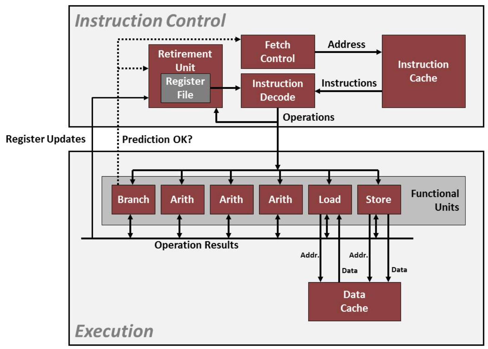

- ideas of pipeline


(`p1 = a*b`, dependency)

- Loop Unrolling

For making use of multi-core processor

```c
for (i = 0; i < limit; i += 2){
  // x = x + array[i] + array[i+1];
  x = x + (array[i] + array[i+1]);  // can break the sequential dependency
  
  // another idea
  // x0 = x0 + array[i];
  // x1 = x1 + array[i+1];
}
```

Note: Not always useful, based on the processor

- SIMD operations

Based on wide registers:


Also called **AVX instructions**

### Dealing with Conditionals

In order to making instructions run smoothly. We introduce the **branch predict**


- Simply **guess** the branch to go
- Begin executing instructions at predicted position


- It can recover when mis-prediction, causing huge performance cost

### C Review

- Be careful when `unsigned u > -1`: `-1` is the biggest when unsigned
- Initialize array with exact value
- Remember there is a `\0` at the end of string
- When `sizeof(xx)`, make sure xx is not a pointer
- Remember to `free` after `malloc`
- Don't return a pointer pointing at a local variable
- `int *a;` when `a + 1`, address of a actually add `sizeof(int) * 1 = 4`

## 6. Memory

### Storage technologies and trends

- Random-Access Memory(RAM)
  - SRAM(static, expensive, cache, volatile: lose information when power off)
  - DRAM(dynamic, main memory, volatile)

- Read-only memory(ROM)
  - nonvolatile: keep information when power off
  - BIOS, firmware programs saved in ROM

- Bus(collection of parallel wires) structure


- Disk


capacity: `512 bytes/sector * 300 sectors/track(on average) * 20000 tracks/surface * 2 surfaces/platter * 5 platters/ disk = 30.72GB`

disk access:

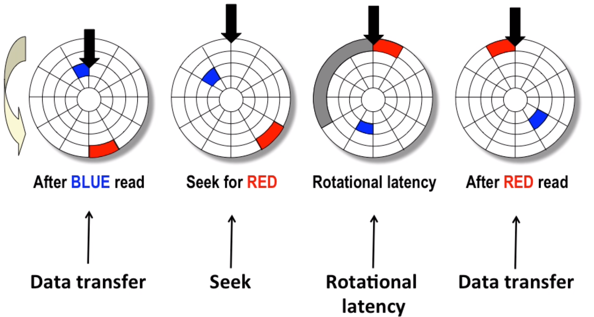

Normally `disk access time = seek time(4~9ms) + rotation(2~5ms) + transfer(0.02ms)`, much slower than RAM(`ns`)

- Bus structure expand

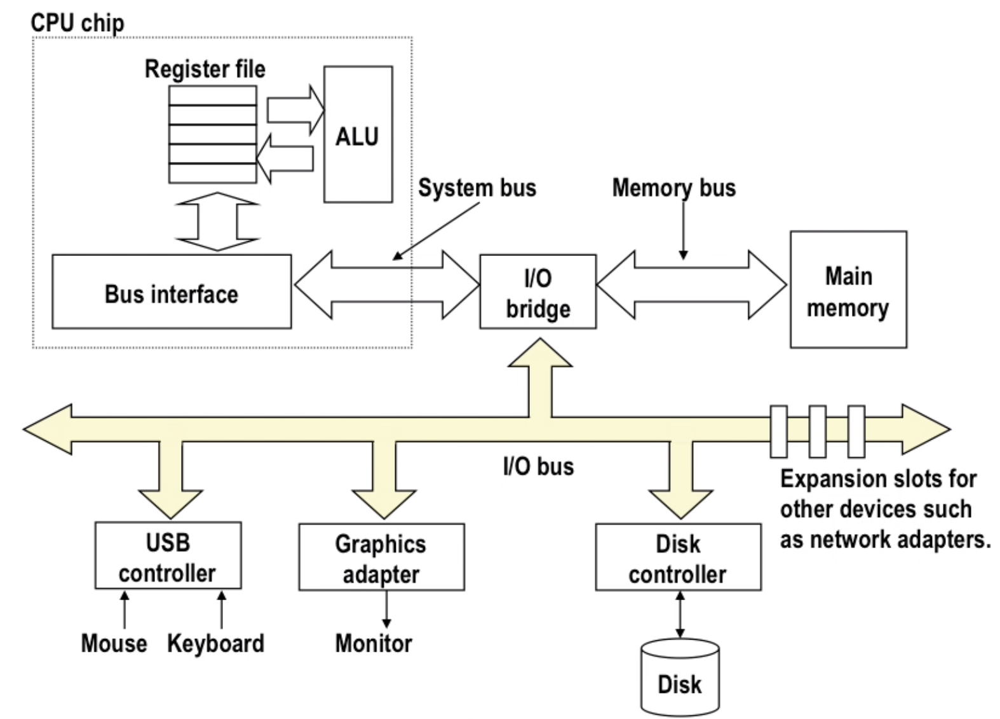

Note: this is not the modern design, which use point to point connection instead of a public wire

- **interrupt**: cpu never waits for disk, when data is carried from disk to memory, it will notify cpu and let cpu continue to work on that data.

- solid state disk(ssd): much faster than normal disk

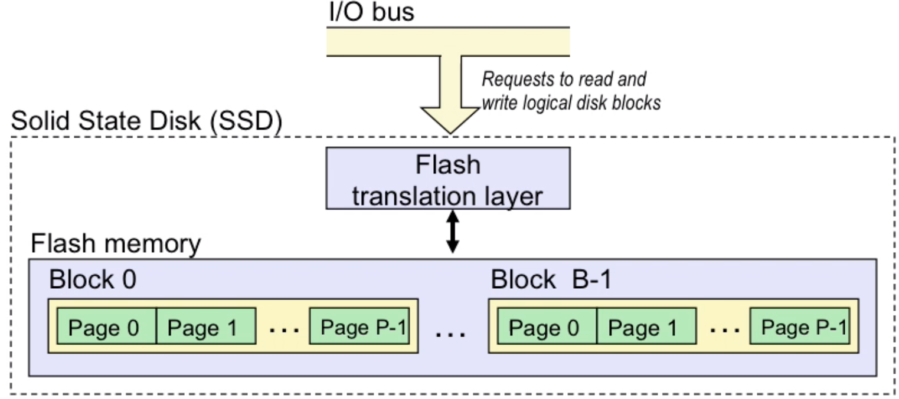

- cpu-memory-gap

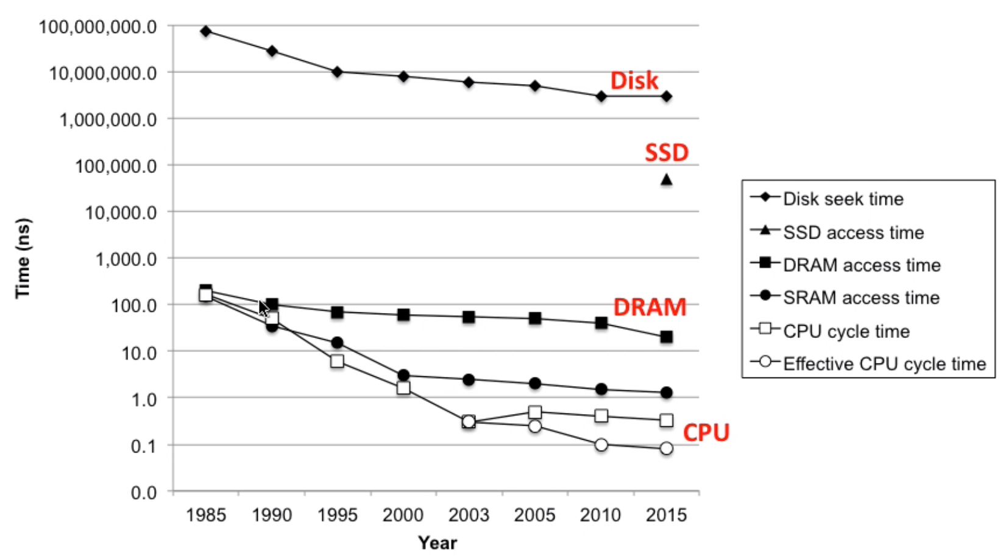

### Locality of reference

- **principle** programs tend to use data and instructions with addresses near or equal to those they have used recently

### Caching in memory hierarchy


### Cache memory organization and operation

- general cache organization

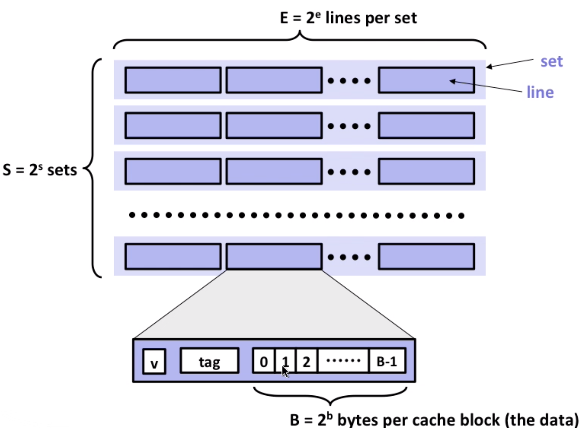

`cache_size = S * E * B bytes`

- cache read


1. locate **set**
2. check all lines in set to match **tag**
3. **tag** matches and **valid** is true: **hit**
4. locate data by **offset**

Note: if not match, old line is **evicted and replaced**

- simple example

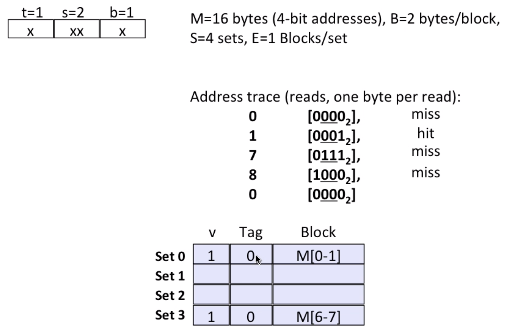

When there comes a `8 [1000]`, it will miss, and set 0 is evicted


And when there comes a `0 [0000]`, it will miss again


However, if we change the bits of lines, it will change.

- block size: hyperparameter of memory system
  - if too small: locality principle(easily use nearby bytes) is not used
  - if too large: long time to evict memory

to be continued ...
