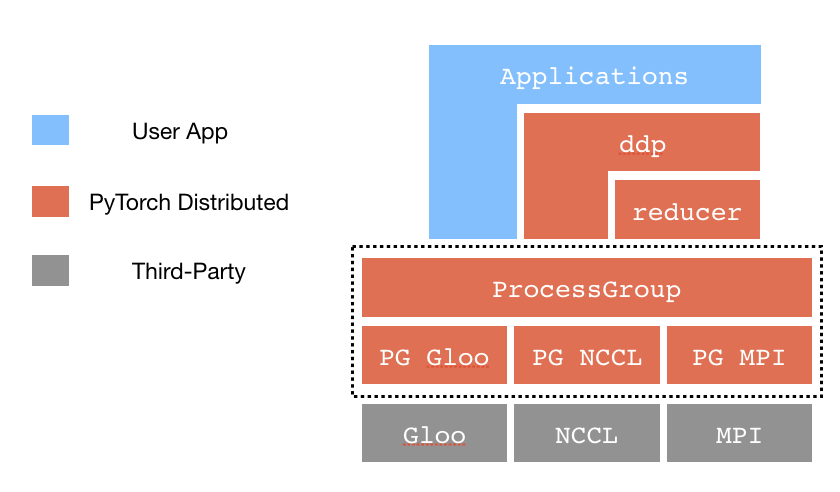

## Summary

本文提供了一个关于PyTorch分布式训练能力的全面概述，涵盖了`torch.distributed`的核心组件，深入探讨了**Distributed Data-Parallel Training (DDP)**、**RPC-Based Distributed Training**和**Collective Communication (c10d)**等内容。

## Introduction

`torch.distributed`主要有三种核心组件：

- **Distributed Data-Parallel Training (DDP)**：分布式数据并行训练，通过在多个计算设备上并行处理数据来加速训练过程
- **RPC-Based Distributed Training (RPC)**：基于RPC的分布式训练，对DDP的补充，尤其适用于模型不容易直接使用数据并行训练的情境。
- **Collective Communication (c10d)**：通信库，是DDP和RPC的基础。一般情况下，用户不会直接调用此库，而是使用DDP和RPC直接进行分布式训练。

## Data Parallel Training

数据并行训练主要有以下几种case：

1. 单机多卡训练（DP）：通过DP利用单机多GPU进行训练加速，易于使用代码改动量小，但性能较低（单process多threads受**GIL**影响）
2. 单机多卡训练（DDP）：通过DDP利用单机多GPU进一步加速，改动代码量多一些
3. 多机多卡训练（DDP + [launching_script](https://github.com/pytorch/examples/blob/main/distributed/ddp/README.md)）：如果想利用多机多卡进行训练，使用此方式
4. 多机多卡训练+动态资源调整/错误恢复：使用[torch.distributed.elastic](https://pytorch.org/docs/stable/distributed.elastic.html)

### `torch.nn.parallel.DistributedDataParallel`

相比于DP，DDP需要额外步骤来启动，例如调用`init_process_group`。

通过多进程并行，DDP规避了GIL的限制。此外，DDP时模型只会在构建阶段被广播一次（DP每次都会在前向运算时广播），在后续训练阶段不再需要广播，而是同步模型参数更新。

因此DDP的性能会比DP要高很多

运行DDP的简单例子：

```py
import torch
import torch.distributed as dist
import torch.multiprocessing as mp
import torch.nn as nn
import torch.optim as optim
from torch.nn.parallel import DistributedDataParallel as DDP


def example(rank, world_size):
    # create default process group
    dist.init_process_group("gloo", rank=rank, world_size=world_size)
    # create local model
    model = nn.Linear(10, 10).to(rank)
    # construct DDP model
    ddp_model = DDP(model, device_ids=[rank])
    # define loss function and optimizer
    loss_fn = nn.MSELoss()
    optimizer = optim.SGD(ddp_model.parameters(), lr=0.001)

    # forward pass
    outputs = ddp_model(torch.randn(20, 10).to(rank))
    labels = torch.randn(20, 10).to(rank)
    # backward pass
    loss_fn(outputs, labels).backward()
    # update parameters
    optimizer.step()

def main():
    world_size = 2
    mp.spawn(example,
        args=(world_size,),
        nprocs=world_size,
        join=True)

if __name__=="__main__":
    # Environment variables which need to be
    # set when using c10d's default "env"
    # initialization mode.
    os.environ["MASTER_ADDR"] = "localhost"
    os.environ["MASTER_PORT"] = "29500"
    main()
```

## RPC-Based Distributed Training

对于DDP无法处理的一些情况，例如参数服务器范式（Parameter Server Paradigm，分为工作节点和参数服务器节点，工作节点负责模型计算，参数服务器节点PS负责存储模型参数）、分布式流水线并行（distributed pipeline parallelism，也称作分布式管道并行，指模型被划分为多个阶段，分布在多个节点上，第一个阶段处理完发送到下一个阶段，以此类推）等，RPC就能够派上用场了。

**torch.distributed.rpc**包含四个主要支柱：

1. [rpc](https://pytorch.org/docs/stable/rpc.html#rpc)：RPC提供了在远程worker上执行函数的能力
2. [RRef](https://pytorch.org/docs/stable/rpc.html#rref)：Remote REFerence，帮助管理remote object的生命周期
3. [Distributed_Autograd](https://pytorch.org/docs/stable/rpc.html#distributed-autograd-framework)：扩展autograd引擎，实现多机器autograd计算
4. [Distributed_Optimizer](https://pytorch.org/docs/stable/rpc.html#module-torch.distributed.optim)：分布式优化器，将分布式autograd引擎计算得到的梯度分发给其他worker来计算参数更新。

一个简单的RPC例子：

```py
import os
import torch.distributed.rpc as rpc
import torch.multiprocessing as mp

def remote_square(x):
    print(f"Received {x} from caller. Computing its square...")
    return x * x

def worker(rank, world_size):
    rpc.init_rpc(
        name=f"worker{rank}",
        rank=rank,
        world_size=world_size
    )
    rpc.shutdown()

def caller(rank, world_size):
    rpc.init_rpc(
        name=f"caller{rank}",
        rank=rank,
        world_size=world_size
    )

    response = rpc.rpc_sync(to="worker1", func=remote_square, args=(5,))
    print(f"Caller received: {response}")

    rpc.shutdown()

def main(rank, world_size):
    os.environ["MASTER_ADDR"] = "127.0.0.1"
    os.environ["MASTER_PORT"] = "29502"

    if rank == 0:
        caller(rank, world_size)
    else:
        worker(rank, world_size)

if __name__ == "__main__":
    world_size = 2
    mp.spawn(main, args=(world_size,), nprocs=world_size)
```

## Collective Communication (c10d)

**Collective Communication**是多个进程或工作节点间同步和交换数据的基础，支持DDP和RPC

### 基础操作

- **send/isend**：点对点发送数据
- **broadcast**：一个节点数据广播到所有节点上


- **reduce**：所有节点数据通过某种运算（比如求和）reduce到一个指定节点


- **all-reduce**：所有节点数据进行reduce运算，结果分发到所有节点


- **scatter**：划分某个节点的数据为多份，分别发送给其他节点
- **gather**：所有节点数据汇集到一个节点上
- **all-gather**：所有节点数据汇集，并分发到所有节点


- **reduce-scatter**：与reduce操作类似，但结果会划分到多个节点上


- **all-to-all**：每个节点按照自己的列表发送和接收其他节点的不同数据

collective communication APIs如`all-reduce`、`all_gather`等用于DDP训练，P2P communication APIs如`send`、`isend`等用于RPC训练

### 通信后端

`c10d`支持多种后端，包括：

- **Gloo**：开源通信库，CPU默认后端，跨平台并拥有可靠性能，不需要特定系统依赖
- **NCCL**（NVIDIA NCCL (NVIDIA Collective Communications Library) ：多GPU、多节点通信库，给NVIDIA GPU提供了最佳性能
- **MPI**(Message Passing Interface) ：用于在多计算节点上进程间消息传递。MPL不是pytorch默认后端，需要额外安装与适配才能使用。

一般地，CPU用Gloo，GPU用NCCL，如果你对MPI很熟悉且已经正在使用MPI通信，那么考虑额外安装MPI。

## 扩展阅读——Pytorch Distributed架构

### C10D 与 DistributedDataParallel



- **Process Groups**（PG）：管理进程间通信，暴露了一系列通信API，如`broadcast`、`send`、`all-reduce`等。

- **Store**：一个键值存储系统，用于进程间共享信息。包含`FileStore`（一个共享文件存储键值对）、`TCPStore`（使用TCP服务器存储）、`HashStore`（在内存中存储，用于单进程模式或测试），以及第三方store如`etcd`、`Redis`等。

- **Reducer**：负责收集各个设备上的模型梯度，进行reduce运算（如平均计算），然后将梯度广播回所有节点，确保模型参数更新一致。Reducer使用了一种**Bucketing**策略，将多个参数的梯度组合在一起然后整网一次广播提高带宽利用率。

### RPC Framework


**RPC Agents**：为了支持不同通信协议和后端，pytorch提供了**Agent**的抽象，负责处理跨进程消息传递。包含`ProcessGroupAgent`（基于c10d::ProcessGroup实现）、`TensorPipeAgent`（专门为tensor通信优化的agent）等

## Referrence

- [PYTORCH_DISTRIBUTED_OVERVIEW](https://pytorch.org/tutorials/beginner/dist_overview.html)
- [DDP](https://pytorch.org/docs/stable/generated/torch.nn.parallel.DistributedDataParallel.html)
- [GIL](https://wiki.python.org/moin/GlobalInterpreterLock)
- [RPC](https://pytorch.org/docs/stable/rpc.html)
- [c10d](https://pytorch.org/docs/stable/distributed.html)
- [Contributing to PyTorch Distributed](https://github.com/pytorch/pytorch/blob/main/torch/distributed/CONTRIBUTING.md)
- [NCCL](https://docs.nvidia.com/deeplearning/nccl/user-guide/docs/usage/collectives.html#allreduce)
