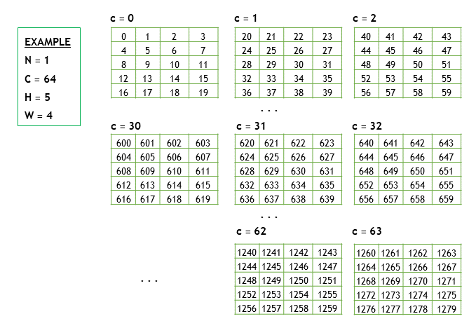
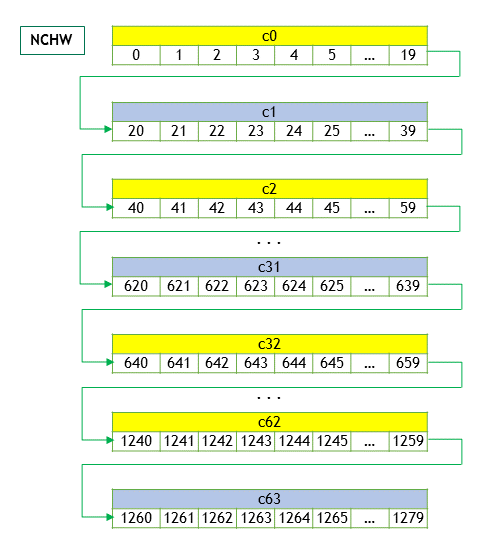

## Summary

本文介绍了pytorch中常用的两种内存存储形式**NCHW**和**NHWC**，深入讨论了**Stride**和**Contiguous**等概念，并解释了改变Tensor内存结构的原理和过程。

## 实例引入

假设有一个NCHW的Tensor X， `X.shape = [1, 64, 5, 4]`，行优先排序（row-major），如下图所示



其内存排序如图所示（优先访问W、H，然后通道C +=1）



如果它是以NHWC的形式排布，那么将变为（优先访问不同通道的数据，然后再W、H+=1）


## Stride, Contiguous介绍

```python
import torch

N, C, H, W = 1, 64, 5, 4
x = torch.rand(N, C, H, W)
print(x.shape)              # torch.Size([1, 64, 5, 4])
print(x.stride())           # (1280, 20, 4, 1)
print(x.contiguous())       # True
```

**Stride**即**在内存中需要迈出去的步长**，其计算方式如下

```c++
size_t stride = 1;
for (int i = ndim_ - 1; i >= 0; i--) {
    stride_[i] = stride;
    stride *= shape_[i];
}
```

例如，每要取下一个H的值，我们知道要遍历4个行元素（W=4），那么我们就可以根据`stride[2]=4`直接拿到这个值，并让内存指针加4，获取到我们需要的元素。再比如要取下一个C，内存指针直接+20，就可以取到对应值。

**Contiguous**即内存空间排布是否连续，因为我们是行优先，所以能按照行的顺序访问即符合连续定义，是否连续判定代码如下：

```c++
bool is_contiguous() const {
    size_t stride = 1;
    for (int i = ndim_ - 1; i >= 0; i--) {
        if (stride_[i] != stride) {
        return false;
        }
        stride *= shape_[i];
    }
    return true;
}
```

一般地，对tensor的操作（如transpose、permute等）只改变tensor的描述（shape、stride），不会改变tensor实际内存结构。例如：

```py
import torch

N, C, H, W = 1, 3, 2, 2
x = torch.randint(1,30,(N, C, H, W))
print(x.is_contiguous())        # True
print(x.storage())              # [25, 29, 28, 6, 12, 25, 4, 20, 17, 21, 19, 5]
print(x.shape)                  # torch.Size([1, 3, 2, 2])
print(x.stride())               # (12, 4, 2, 1)
x = torch.transpose(x, 0, 2)
print(x.is_contiguous())        # False
print(x.storage())              # [25, 29, 28, 6, 12, 25, 4, 20, 17, 21, 19, 5]
print(x.shape)                  # torch.Size([2, 3, 1, 2])
print(x.stride())               # (2, 4, 12, 1)
```

然而memory format的变更不仅改变tensor的描述，还需要直接改变tensor的storage，如下文中NCHW和NHWC之间的转换就改变了内存结构。

## NCHW 和 NHWC 之间的转换

```python
import torch

N, C, H, W = 1, 64, 5, 4
x = torch.rand(N, C, H, W)
x = x.contiguous(memory_format=torch.channels_last)
print(x.shape)              # torch.Size([1, 64, 5, 4])
print(x.stride())           # (1280, 1, 256, 64)
print(x.is_contiguous())    # False
```

可以看到，shape没有发生改变，而stride从`(1280, 20, 4, 1)`变为了`(1280, 1, 256, 64)`

该stride变化是如何产生的呢？请看下面的代码

```c++
int64_t stride = 1;
for (auto k : {1, 3, 2, 0}) {
    strides[k] = stride;
    stride *= shapes[k];
}
```

即优先访问C上元素，再访问W、H最后访问N。

是怎么通过stride实现这样优先访问的呢？我们首先要了解它是如何取值的

```c++
// 通过索引取值
data_t operator[](std::vector<size_t> idxs) const {
    size_t offset = 0;
    for (size_t i = 0; i < ndim_; i++) {
        offset += idxs[i] * stride_[i];
    }
    return data_[offset];
}
```

例如，用户访问`tensor_channel_last[0,1,0,0]`的数据，想获取下一个c的值，那么`offset = 1280 * 0 + 1 * 1 + 256 * 0 + 64 * 0 = 1`，正好取到了`offset=1`的数据

这里就引出了一个疑问，数据指针`offset=1`不是指向w=1的值吗？所以当变更为channel-last之后，**数据在内存一维数组上的排布也发生了改变**，以符合适配的`offset`。

我们取一个小一点的tensor来分析内存排布

```py
import torch

N, C, H, W = 1, 3, 2, 2
x = torch.randint(1, 30, (N, C, H, W))
print(x.storage())  # [ 14 16 20 11 8 26 15 18 29 21 10 3]
x = x.contiguous(memory_format=torch.channels_last)
print(x.storage())  # [ 14 8 29 16 26 21 20 15 10 11 18 3]
```

可以看到，原本索引为4的8（对应`c1h0w0`）现在索引变为了1，正好与新的stride适配。

## 为什么要做NCHW和NHWC的区分和转换——性能上的提升

在部分算子运算时，其实更需要获取下一维度的C，如果按照continuous取法，那么偏移量为`H*W`，虽然取值仍然是`O（1）`，但却无法命中缓存导致性能下降。转换为NHWC后，每一次取C的值都会变得很便利。

根据pytorch文档显示，和AMP（`Automated Mixed Precision`，自动混合精度）一起使用的时候，在NVIDIA GPU上可以取得22%的性能提升。即使只在CPU上，也能因为更好命中缓存而取得性能提升。

## Reference

- [NVIDIA Deep Learning cuDNN Documentation](https://docs.nvidia.com/deeplearning/cudnn/developer-guide/index.html)
- [Pytorch NCHW/NHWC](https://zhuanlan.zhihu.com/p/556222920)
- [(BETA) CHANNELS LAST MEMORY FORMAT IN PYTORCH](https://pytorch.org/tutorials/intermediate/memory_format_tutorial.html)
