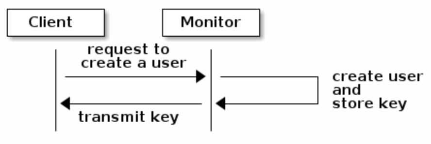
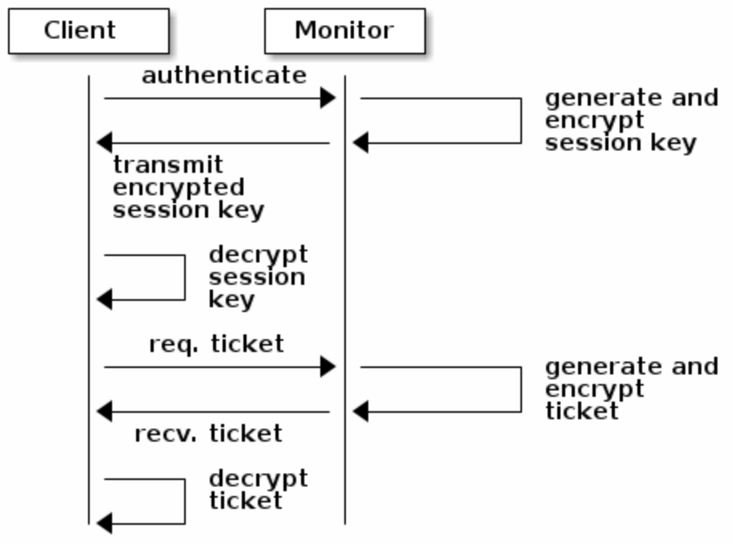
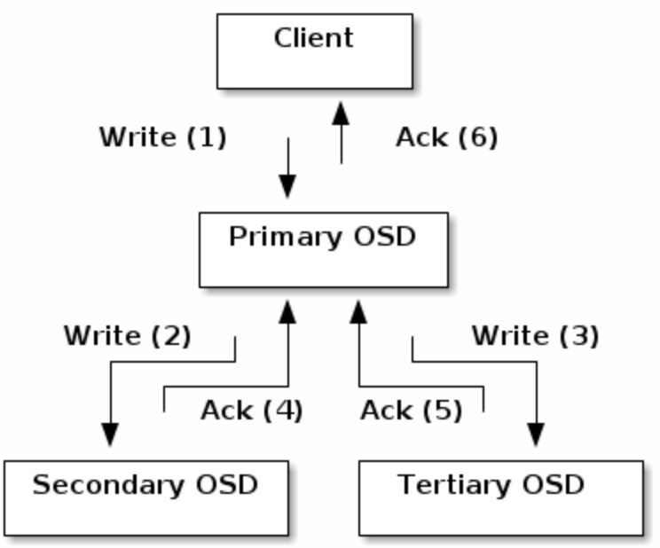
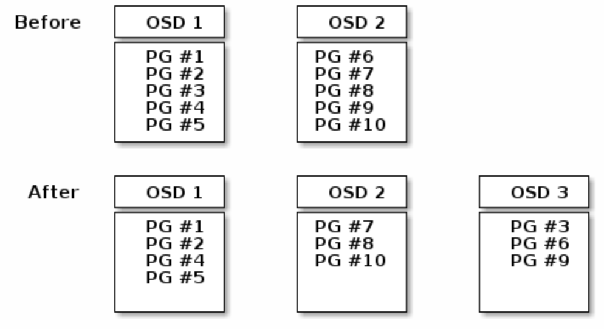
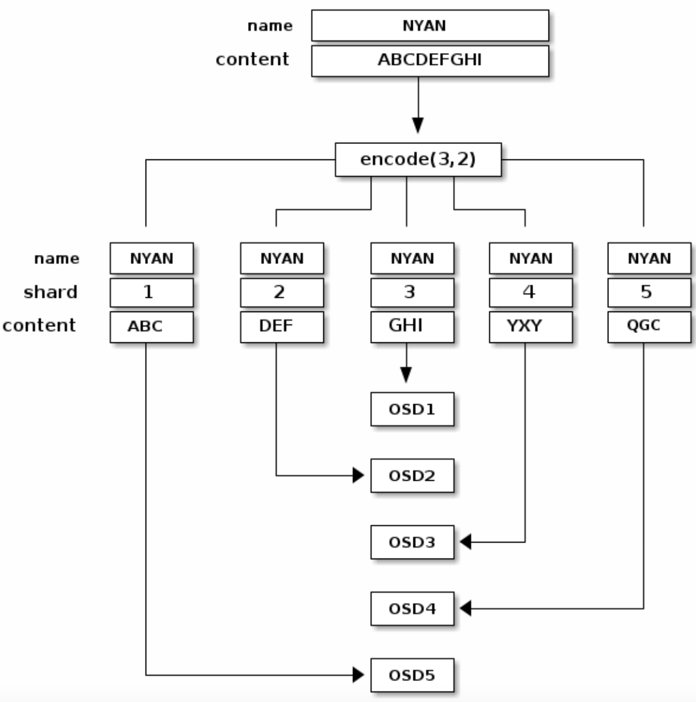
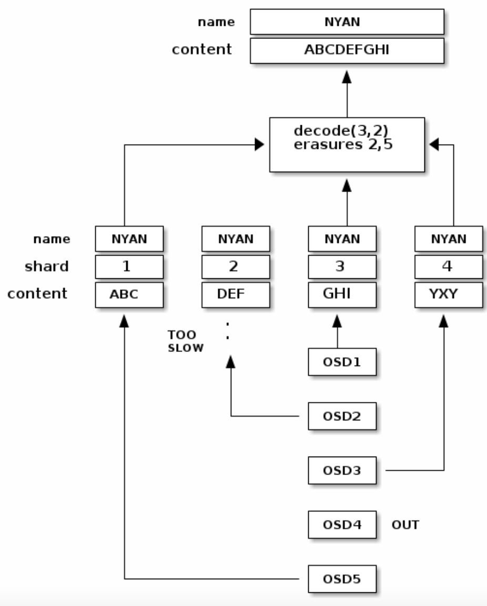
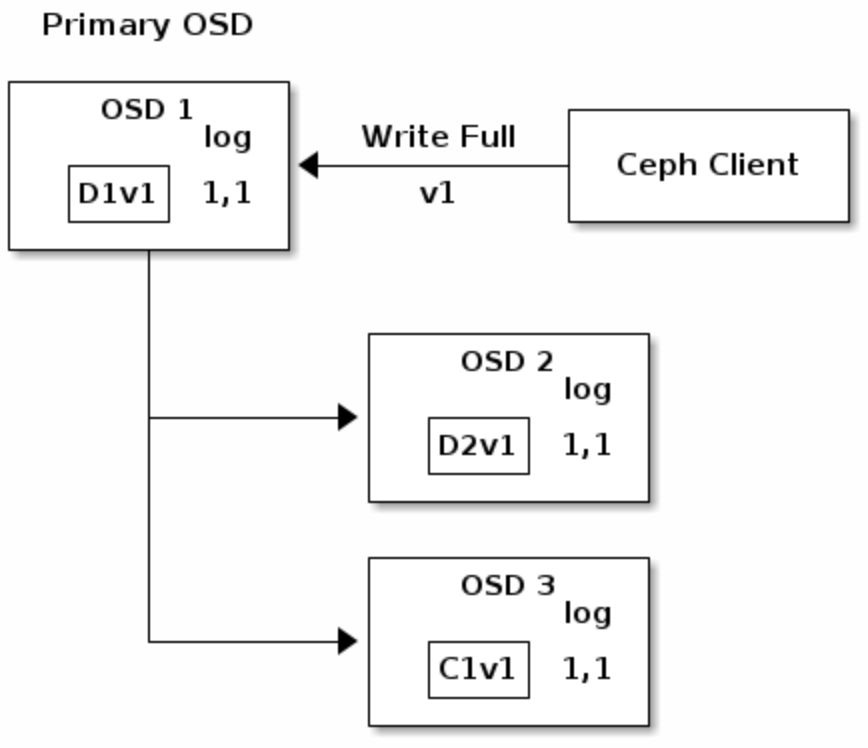
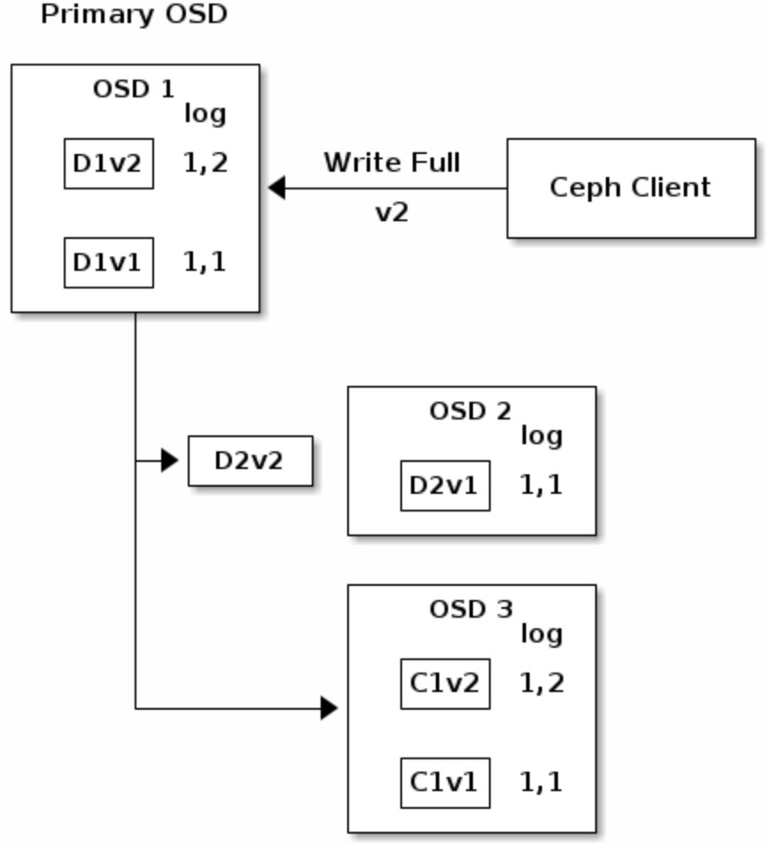
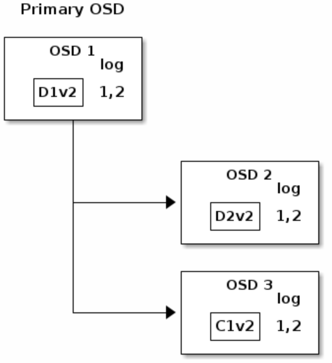

## Summary

This article introduces the basic concepts of Red Hat Ceph.

## To be translated

Oh Sorry!

This blog has't been translated to English, please wait for a little while...

## 简述

- Red Hat Ceph是一个分布式的数据存储系统，提供了对象、块和文件存储的功能

- 核心组件：

- **OSD**：
  - `Object Storage Daemon`，守护进程，
  - 实际存储数据，处理数据备份、恢复等，检查自身状态和其他osd的状态（by heartbeat）并且返回给monitor
  - 一般至少使用三个osd以保证高可用。

- **Monitor**：
  - ceph监视器（`ceph-mon`）
  - 通过一系列的map来跟踪集群健康状态，也负责管理daemon和client间的权限验证。
  - 持有一个cluster map的主副本，，clients从monitor这拿到cluster map的副本
  - 通过monitor集群来防止某个monitor挂掉。为了保证高可用性和冗余，一般使用至少三个monitor

- **Managers**：
  - `ceph manager daemon`，守护进程
  - 一个Ceph管理器作为监控、协调和插件模块的终端
  - 跟踪当前运行时指标和ceph集群状态，如存储利用率和系统负载等。
  - 一般至少两个manager来保证高可用

- **MDS**
  - `metadata server`，ceph 元数据服务器
  - 跟踪文件层次结构，管理file metadata并在cephFS提供文件服务时给cephFS提供元数据（注：RBD和RGW不需要元数据，也不需要MDS）
  - 兼容POSIX文件系统，支持`ls`/`find`等命令而不会给ceph集群带来负担

- ceph 将数据作为对象存储在逻辑存储池中。通过使用`CRUSH`算法，ceph 计算出对象应该存储在哪个**PG**（placement group）中，和PG应该存储在哪个OSD中。

- 术语概览：
  - **RADOS**：可靠、自动、分布式对象存储（Reliable Autonomic Distributed Object Store），ceph集群存储的基础，确保数据一致性和可靠性
  - **RBD**：（rados block device）ceph块设备，对外提供块存储，可以像磁盘一样挂载到服务器
  - **RGW**/**RADOSGW**：（rados gateway）ceph对象网关，提供了兼容s3和swift的restful api接口
  - **librados**：用来简化访问 rados的方法，支持PHP、java、python等多种语言。librado是RBD和RGW的基础，并为cephFS提供POSIX接口
  - **cephFS**：兼容POSIX，可任意扩展的分布式文件系统，依赖MDS。
  - **PG**：placement group，归置组，一组对象的逻辑集合
  - **POOL**：ceph逻辑上的数据存储池，便于管理对象
  - **POSIX**：可移植操作系统接口（Portable Operating System Interface of UNIX），它定义了操作系统应该为应用程序提供的接口标准。也称为IEEE 1003或ISO/IEC 9945。一个POSIX兼容的操作系统写的程序需要支持在任一个POSIX操作系统（即使是不同厂商）上编译执行。

## 架构

- 补充概念
  - **QEMU/KVM**：一种虚拟机
  - **FUSE**：用户文件系统空间（FileSystem in Userspace），是一个面向类unix操作系统的软件接口，允许无特权用户无需编辑内核代码就能创建自己的文件系统。

## ceph 存储集群

CEPH基于rados提供了一个无限扩展的存储集群，一个存储集群有若干守护进程：`Ceph Monitor`, `Ceph OSD Deamon`, `Ceph Manager`, `Ceph Metadata Server`

### 数据存储

- ceph存储集群从client处接收data，存储为RADOS object对象。每个object 存储在object storage device上，由OSD daemon来处理read、write和replication等操作
- 使用较旧的文件系统后端时，每个RADOS object 存储在单独的文件中（如`XFS`，一种日志型文件系统）；使用新的`BlueStore`后端时，文件以数据库的形式存储
- 一个object有一个identifier（全局唯一）、binary data和 k-v metadata（语义由client决定。例如cephFS使用metadata来存储object owner、创建时间等）

### 可扩展性和高可用

- 传统架构中，clients与一个中心化的组件（如gateway等）通信，这限制了性能和可扩展性，如gw挂掉，整个系统也挂掉了。

- Ceph删掉了中心化的Gateway，允许clients直接和ceph OSD交互
- Ceph OSD deamon在其他ceph 结点上创建数据副本以保证数据安全和高可用。

#### CRUSH 介绍

- ceph clients 和 OSD deamon都使用`CRUSH`算法来计算object位置，而不是使用一个中心化的lookup算法

#### Cluster map

- ceph 依赖于ceph client和osd知道集群映射关系，这些映射关系通过五个map（统称为`cluster map`来表示）
- **Monitor map**
  - 包含cluster `fsid`，monitor的地址、端口等信息，以及目前的`epoch`
- **OSD map**
  - 包含`fsid`，一个`pool`的列表、`replica size`，`PG number`，osd和它们状态的列表等
- **PG map**
  - 包含最后一个osd map的`epoch`，`full ratios`，每个placement group的细节等，以及每个pool的数据使用情况
- **CRUSH map**
  - 包含storage list的存储列表，`the failure domain hierarchy`(如, device, host, rack, row, room, etc.), 以及存储数据时遍历hierarchy的规则等
- **MDS map**
  - 包含当前MDS的`map epoch`，创建和更新时间，存储metadata的`pool`，metadata server列表等

- ceph monitor持有所有map的主备份

#### 高可用的 monitor

- 在ceph client 读写数据之前，都需要和ceph monitor通信来获取最新cluster map。
- 一般使用三个monitor作为集群减少故障率。
- 基于**Paxos**共识算法搭建集群

#### 高可用的 authentication

- ceph使用`cephx` protocal鉴权系统（注意：不涉及传输层的数据加密如ssl/tls）
- ceph是直接让client和OSD交互而没有引入gateway的。
- `cephx`核心思想是client和monitor都有一份client的secret key，让client和cluster知晓对方有一份secret key实现鉴权而不需要暴露它（以减少中间人攻击）
- 为了使用`cephx`，administrator必须先创建user和对应的secret key，再通过安全的方式把user id和secret key传给用户
  
- 主要流程：
  - client请求monitor鉴权，monitor产生`session key`并用secret key加密返回
  - client用自己的permanent secret key解密数据获取`session key`，再使用session key请求monitor索取ticket
  - monitor生成一个ticket，再次用secret key加密后返回
  - client解密该ticket并拿ticket请求OSD和metadata server
  

#### 守护进程使超大规模成为可能

- 一般而言，集群都有一个中心化的接口知道该访问哪个节点，这是大规模数据时的一个大的性能瓶颈。
- ceph消除了这个瓶颈，OSD daemon和client都知道集群信息，OSD daemon可以与其他OSD deamon直接交流，client也可以直接和OSD通信。
- **OSD membership and status**：OSD daemon有两种状态：`up`和`down`。如何知道一个OSD daemon挂了？可能是monitor长期未收到心跳，给它一个status `down`，或者是其他OSD deamon发现这个OSD deamon挂了并report 给monitor
- **Replication**：
  - client使用`CRUSH`算法计算数据应该存在哪，然后查看`CRUSH map`来获知placement group的 primary OSD，将数据上传
  - 数据写到primary OSD后，OSD deamon同样使用`CRUSH`算法计算数据应该备份在哪里。如找到第二个和第三个备份OSD，将数据复制过去。收到所有备份成功的ACK之后，告知client存储成功
  
- **Data Scrubbing**：为了确保数据一致性，OSD deamon会比较自己和其他OSD的数据备份并做清理操作，如比较size 和 metadata（一般每天进行）或者 逐bit比较并校验checksum（deep scrubbing，一般每周进行）

### 动态集群管理

#### pools

- `pools`是ceph存储对象的逻辑分区，client上传数据时，先传到`pool`处，再由pool选择CRUSH rule

- `pools`设置了以下参数
  - ownership/access
  - placement group的数量
  - CRUSH rule

#### MAPPING PGS TO OSDS

- 每个pool都有一些**placement group**（PG）实际存储对象，当client存储object的时候，crush算法将object映射到对应PG中，再由PG动态映射到OSD

- 通过引入PG这一间接层，ceph将client和OSD解耦，这有助于`rebalance`

#### CALCULATING PG IDS

- 当client访问ceph monitor的时候，client拿到了最新的Cluster map，知道了monitor、osd和metaserver的信息。**然而，client不知道object具体存储在哪里——需要计算object的具体位置**
- 计算具体流程
  - client输入pool name和object id（例如：`pool` = “liverpool” and `object-id` = “john”）
  - ceph 拿到输入并 hash `object-id`
  - ceph将hash mod PG的数量来获取一个一定存在的PG id（例如，`58`）
  - ceph 根据 pool name拿到pool id（例如, “liverpool” = `4`）
  - ceph将pool id附加到pg id中（例如，`4.58`）

- 计算具体位置要比负载较高时每次请求location效率高，ceph的`CRUSH`算法就能够允许client来计算object应该存储的location并直接和primary osd通信。

#### PEERING AND SETS

- **peering**：让所有存储数据在PG上的OSD达成共识——object的状态和metadata在PG上存储正常（注意：这种共识不意味着PG存储的object都是最新的）
- 默认ceph会有两份数据备份（`size=2`），为了更高可用性ceph应该有更多的数据备份（`size=3`&`min size=2`）
- **Acting Set**：当一些OSD负责一个PG的时候，这些OSD被统称为acting set
- primary OSD是`Acting set`中的第一个OSD，负责为每个placement group`peering`，也是唯一接受client发起的写入object请求的OSD。例如：一个acting set有`osd.25, osd.32 and osd.61`，primary就是`osd.25`，当primary挂了时，secondary `osd.32`变成primary
- 当acting set中的OSD fail的时候，ceph可以remap PG给其他OSD

#### REBALANCING

当新的OSD deamon被加入到ceph 集群时，`cluster map`会做更新，并reblance PG。

#### DATA CONSISTENCY

- ceph 默认 每天对placement group中的object进行**scrub**

- `scrub`即比较一个PG的object和其他PG的副本的size、metadata等信息保证一致性。

- 默认每周会进行`deep scrub`——深度比较object的bit level信息并计算checksum。这里如果有问题，一般是硬盘有坏区。

### ERASURE CODING 错误纠正编码

- 一个错误纠正编码池`erasure coded pool` 将每个object划分为`K+M`个chunk，其中`k`个数据 chunk，`M`个coding chunk。
- 每个chunk存储在acting set的一个OSD中
- 例如：使用5个OSD存储object的（K=3，M=2）可以忍受丢失其中两个chunk

#### READING AND WRITING ENCODED CHUNKS

如图所示，name为`NYAN`的object被划分成3个数据块和2个纠错编码块

如果OSD2太慢，OSD4挂掉，那么在读取该object的时候，ceph会读取OSD1、2、5的chunk并重新拼接处object，如下图所示

#### INTERRUPTED FULL WRITES

在错误纠正编码池中，primary OSD负责接收并处理所有write请求，负责编码为`K+M`个chunk并发送到其他OSD，也负责维护一份placement group的权威日志

- 例如，`K=2，M=1`时写object如图所示

其中`D1V1`表示数据data chunk1 version1，`C1V1`表示erasure coding chunk1 version1，`log 1,1`表示epoch1 version1

- 当client `WRITE FULL`（覆盖旧object）时，version变化如图所示

在OSD3收到数据chunk并写入后，会更新自己的日志来反映变化。

注意因为系统整体是异步的所以可能存在有`D2V2` in flight的中间态

- 如果一切都正常运作，每个chunk都在OSD上正常存储，那么log的`last_complete`会指向`1,2`，移除旧版本的chunks

- 但如果`D2V2` in flight、`C1V2`正常写入时 OSD1挂了，实际损失了`D2V2`和`D1V2`两个chunk，由于`K=2 M=1`需要两个chunk才能恢复，所以认为写入失败需要回滚。

[image](resources/ceph-erasurecoding6.png)

此时新接入了OSD4为primary并读取log发现`last_complete`指向`1,1`（在`last_complete`版本之前的所有object认为是available的），并使`1,1`成为新的权威日志的head

[image](resources/ceph-erasurecoding7.png)

随后，OSD3上的`C1V2`被移除，`D1V1`在OSD4上被重建，数据成功回滚到V1版本。

### CACHE TIERING 缓存分层

我们可以使用高性能的存储设备作为**cache tier**，使用经济但低效的存储设备作为**storage tier**。由**ceph objector**负责选择object存储在哪里。

### EXTENDING CEPH

- **ceph class**：可以通过ceph class来自定义新的方法，并在方法中调用ceph 原生函数实现功能扩展。

- Ceph会自动读取在`osd class dir`的`.so` class并应用
- 例如：可以接收一个bitmap image，进行缩放、加水印等操作后再存到object store里。

### summary

- 整个`ceph storage cluster`是一个动态的有机系统。

- ceph通过移除中心化的网关并基于OSD的系统实现了最大化利用服务CPU和内存资源。

## 参考文章与扩展阅读

- [rados详细介绍](https://ceph.com/assets/pdfs/weil-rados-pdsw07.pdf)
- [crush详细介绍](https://ceph.com/assets/pdfs/weil-crush-sc06.pdf)
- [paxos算法详细介绍](https://en.wikipedia.org/wiki/Paxos_(computer_science))
- [ceph-doc](https://docs.ceph.com/en/latest/architecture/)
- [ceph-github](https://github.com/ceph/ceph)
